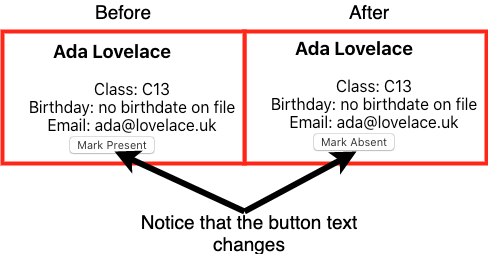

# Event Handling

<iframe src="https://adaacademy.hosted.panopto.com/Panopto/Pages/Embed.aspx?pid=2a27d3b7-8ac3-4be7-81a0-ac930167f3a9&autoplay=false&offerviewer=true&showtitle=true&showbrand=false&start=0&interactivity=all" height="405" width="720" style="border: 1px solid #464646;" allowfullscreen allow="autoplay"></iframe>

## Learning Goals
- Use an event handler to handle a change on a component's element
- Modify `state` via an event handler

### Overview
React allows us to handle many different types of events. We'll focus on a couple of the common events (keyboard and click), but just know that you should reference the [full list](https://reactjs.org/docs/events.html#supported-events) if you want more information.

### Context

In this lecture, we are going to expand upon the `Student` component that we created in the [state lecture](state.md). This was a great component that we created that was storing a student's present status in the component. We used the boolean in the function to determine what to display.

### Adding More Meaning

#### Toggle our Boolean

The boolean value that we're storing in the state seems a little bit useless right now. We set it to `true` as an initial value and we don't ever change it! We have a button and it doesn't do anything!  Next we will add code to change the state of `present` when the button is clicked on.

### onClick Event

Now we'll add the `onClick` attribute to the button whose value will refer to an event handler function that we will create next.

```javascript
// src/components/Student.js
const Student = (props) => {

  const [present, setPresent] = useState(props.present);

  // Function to toggle present
  const onButtonClick = () => setPresent(!present); 

    // Component functions always return JSX
    return (
      <div>
        <h3>{props.fullName}</h3>
        <ul>
          <li>Class: C13</li>
          <li>Birthday: {props.birthday}</li>
          <li>Email: {props.email}</li>
        </ul>
        <button onClick={onButtonClick}>
          Mark {present ? 'Absent' : 'Present'}
        </button>
      </div>
    );
}
```

<!-- >>>>>>>>>>>>>>>>>>>>>> BEGIN CHALLENGE >>>>>>>>>>>>>>>>>>>>>> -->
<!-- Replace everything in square brackets [] and remove brackets  -->

### !challenge

* type: short-answer
* id: d56d960f-309a-4a49-813d-49ecada792d0
* title: Describe code change
points: 1 (optional, the number of points for scoring as a checkpoint) 
topics: react, events

##### !question

Notice: There are only 2 lines that have changed from the state lesson: 

`const onButtonClick = () => setPresent(!present); ` (toward the top)

`<button onClick={onButtonClick}>` (toward the bottom)

What is this new code doing? 

Refer back to the [state lecture](state.md) if you can't remember what the `setPresent` function is supposed to do. 

##### !end-question

##### !placeholder

##### !end-placeholder

##### !answer

/.+/

##### !end-answer

##### !explanation 
It's defining a function named onButtonClick which changes the `present` value to the opposite of whatever it currently is. That function isn't called yet. Instead, it's referenced down below as the `onClick` function for the button we created in the previous lesson. This type of function is termed a _callback function_. It won't be executed until the event occurs. This is the same for all events defined here in our React components.
##### !end-explanation 

### !end-challenge

<!-- ======================= END CHALLENGE ======================= -->


### !callout-info
## Note on arrow function syntax
**Note** the arrow function syntax for this event handler function. You could define the event handler function `onButtonClick` as a regular function, but making it an arrow function in this case is a bit more concise and keeps the `this` context to the current component.  
### !end-callout

Now that we have an event handler function defined and tied to this button, let's take a look at our application running on the server to see what the result is. What happens when the button is clicked?

Above we made a function, `onButtonClick` which calls `setPresent` and passes in the opposite of the current state.  Then we told the button when it is clicked to call that function.

Now whenever the user clicks on the button the student's present state toggles between true and false!



### onClick with an anonymous function

You can also define the function directly in the JSX with an anonymous function like so:

```javascript
<button onClick={() => setPresent(!present)}>
  Mark {present ? 'Absent' : 'Present'}
</button>
```

### Exercise: Change the Name

Another variable that we store is the name. Unfortunately right now, we are passing the `fullName` from props and we **cannot** change the value of our props.

Let's update the Student component in our local repo or in [this sandbox](https://codesandbox.io/s/ada-students-with-state-and-events-forked-8xkti?file=/src/components/Student.js) to allow the user to update a student's name! Here are the steps required to do that.

**1.  Convert `fullName` from using props to state.**

This will require you to use `useState` a second time to set the student's fullName in state.  Then make sure it renders in the browser.

**2.  Add an input field with the value of the `fullName`**

Now we can add an input field and assign it the value of our `fullName` state variable.

```javascript
return (
    <div>
      <h3>{fullName}</h3>
      <input value={fullName} />
      <ul>
   ...
```

Notice however that changing the input doesn't change how `fullName` displays in the `h3` tag.  We need to add an `onChange` event handler to set the state when the input changes.

**3.  Make the state change when the input changes**

Next we will add an event handler function to change the state of `fullName` when the method is called.

```javascript
const onFullNameInputChange = (event) => {
  setFullName(event.target.value);
};
```

Pay attention to the way we've named this callback. Starting event handler names with `on` is a standard convention, and lets other programmers know your intent. The name also gives information about:

- What event happened (`change`)
- Which DOM element was the target of the event (the name input)

Next, we'll need to add a call to the event handler we just wrote.

```javascript
      <input value={fullName} onChange={onFullNameInputChange} />
```

You can see the final version of this [code here](https://github.com/AdaGold/ada-students/tree/5-events).

## Key Takeaway
We tie events to HTML elements in our JSX to handle changes in the state of our components. When we change state (using `setState`), the component will automatically re-render given it's updated values.

## Additional Resources
- [React Docs: Handling Events](https://reactjs.org/docs/handling-events.html)
- [Advanced Docs: Supported Events](https://reactjs.org/docs/events.html#supported-events)
- [React Armory: When should I use Arrow Functions?](https://reactarmory.com/answers/when-to-use-arrow-functions)