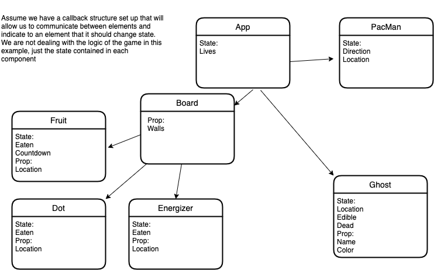

# State in Functional Components

<iframe src="https://adaacademy.hosted.panopto.com/Panopto/Pages/Embed.aspx?pid=be6d3827-59aa-4e75-855d-ac99000b35b3&autoplay=false&offerviewer=true&showtitle=true&showbrand=false&start=0&interactivity=all" height="405" width="720" style="border: 1px solid #464646;" allowfullscreen allow="autoplay"></iframe>

## Learning Goals

After this lesson, students will be able to:

- Understand the `useState` hook
- Write functional components using state

## With Hooks, Functional Components Have State!

In this curriculum, we have focused primarily on functional components when talking about React components.  Compared to class components, they are shorter to write and simpler to read and test.  In early versions of React, however, functional components were 'stateless', meaning they could not use any of the features of state in class components and as a result were not widely used.  State is a powerful tool, and without it, functional components could only be used in limited ways.  To address this issue, the React team added a feature called Hooks that makes it possible to "hook" into state features and use them in functional components.  The Hooks update added several new features to React, including the ability to write custom hooks, but in this lesson we're going to focus on the `useState` hook and adding state features to our functional components.

## Rewriting Student with Functional Components and the `useState` hook

### Adding the `useState` Hook

The first step is adding the `useState` hook to the functional component.  This is done by replacing the `import React from 'react';` line with:

```javascript

import React, { useState } from 'react';

```

The next step is using `useState` inside the component.  `useState` takes one argument, which is the initial value of our state variable, and is only used the first time the component renders.  `useState` returns an array of two elements, the first element is the current value of the state variable and the second element is the function to update the state variable.  The only way to update the state variable is to use the update function that is given to us by `useState`.  Calling the state update function will trigger a render of the component.  In the example below, we are going use `useState` to build a component with a button that adds exclamation points to a sentence.

```javascript

import React, { useState } from 'react';

function Example() {

    // Declare a new state variable
    // We want to start with 1 exclamation point, so we will set the initial value to 1
    const [exclamationCount, setExclamationCount] = useState(1);

    let exclamationString = "";
    for(let i = 0; i < exclamationCount; i += 1) {
        exclamationString += "!"
    }

    return(
        <div>
            <p>I am very excited{exclamationString}</p>
            <button onClick={() => setExclamationCount(exclamationCount + 1)}>
                Add Excitement
            </button>
        </div>
    );
};

export default Example;

```

*Warning* in the above example, `exclamationCount` is *not* the state variable.  `exclamationCount` is the current value of the state variable.  Let's dig into how this works.  On the first render `useState` will set up the state variable and then give us the current value of that variable and the update function.  When we call the update function and pass it a new value of the state variable, the value is stored and then a render is triggered.  Render calls the Example function.  Every time we call the Example function, `useState` is called.  Every time that `useState` is called after the first render, `useState` will grab the current value of the state variable and store it into `exclamationCount`.  We can then use that value in the code in the rest of the Example component.

This brings us to a few important points to note about calling `useState`.

1.  `useState` must be called at the top of the component.
1.  `useState` can not be called from inside a loop or an if statement

Let's say we want to add a button to add question marks to a question in the Example component above.  We can add new state variables by adding additional calls to `useState`:

```javascript

function Example() {

    const [exclamationCount, setExclamationCount] = useState(1);
    const [questionCount, setQuestionCount] = useState(1);

    // ...

}

```

React requires that calls to `useState` (and all hook calls) always happen in the same order for every single render.  Using `if` statements, loops or any control statements with calls to `useState` will cause errors.  Additionally, do not place calls to hooks inside of helper functions, because this can lead to the situation where you (or someone else using your code) may not realize that the helper function calls the hook and then call the helper function, which can lead to out of order hook calls.  If you always place all calls to `useState` and other hooks at the top of your component, you will avoid these potential problems.

###  Student as a Functional Component with State

Let's go back to the Student component from the last lesson that we converted to a class component with state:

```javascript
import React from 'react';

class Student extends React.Component {
  constructor(props) {
    super(props); //props is passed in to the constructor of the component...
    this.state = {
      present: false,
    }
  }
  
  //It's okay to not understand what's going on here yet. 
  //Long story short, I can find out the contents of my <input> 
  //and send them back to the component's state!
  updatePresent = () => {
    this.setState({present: !this.state.present})
  }

  render() {
    //...and when we want to access that data, we can use `this`
    return (
      <div>
      <h3>{this.props.fullName}</h3>
      <ul>
        <li>Class: C14</li>
        <li>Birthday: {this.props.birthday}</li>
        <li>Email: {this.props.email}</li>
      </ul>
      <button onClick={this.updatePresent}>
        Mark {this.state.present ? 'Absent' : 'Present'}
      </button>
    </div>

    );
    }
}

export default Student;
```

Now, lets see what it looks like as a functional component  using the `useState` hook.  First, let's roll back to the functional component version we had before but add `useState` at the top:

```javascript
import React, { useState } from 'react';

const Student = (props) => {
  return (
    <div>
      <h3>{props.fullName}</h3>
      <ul>
        <li>Class: C14</li>
        <li>Birthday: {props.birthday}</li>
        <li>Email: {props.email}</li>
      </ul>
    </div>
  );
};

```

Next, we'll set up our state variable:

```javascript
import React, { useState } from 'react';

const Student = (props) => {
  
  const [present, setPresent] = useState(false);

  return (
    // ...
  );
};

```

Last, we'll add our button and the function `changePresent`:

```javascript
import React, { useState } from 'react';

const Student = (props) => {
  
  const [present, setPresent] = useState(false);

  const changePresent = () => setPresent(!present);

  // Component functions always return JSX
  return (
    <div>
      <h3>{props.fullName}</h3>
      <ul>
        <li>Class: C13</li>
        <li>Birthday: {props.birthday}</li>
        <li>Email: {props.email}</li>
      </ul>
      {/* Note that we will get into what's happening in this line in the Events lesson, coming up next! */}
      <button onClick={changePresent}>
        Mark {present ? 'Absent' : 'Present'}
      </button>
    </div>
  );
};

export default Student;

```

And we're done!  The functional component version is shorter, syntactically simpler to write and easier to read.  Since the addition of hooks, functional components have become the preferred way of writing components.


## PacMan

So far all of our examples have been fairly simple.  Let's look at how state can be used in a more complex way to build the game (PacMan)[https://en.wikipedia.org/wiki/Pac-Man]!  The elements of PacMan are PacMan himself, the ghosts, the dots, the special energizer dots and the fruit.  We could store all of the data at the App level and propagate it down using props.  If we look at all of the moving parts in PacMan, this solution quickly becomes very intricate and requires a lot of logic at the App level. If we think about this problem in terms of state, and letting each element own it's own state, things become much simpler.  Let's start from assuming we have set up a callback structure that allows our elements to know where PacMan is, and that they each have internal logic about what to do if they intersect with PacMan.  We're not going to cover that part of the project in this lesson, we're just going to look at how we could use state to keep track of important information inside each component.  Take a look at this diagram and think about how the state of each component would change as the game progresses:



## Check for Understanding

<!--BEGIN CHALLENGE-->

### !challenge

* type: short-answer
* id: eaac0d52-c7dc-4b88-b40c-b6d0956eb6af
* title: Adding `useState`

##### !question

Starting with the following component:
```javascript

function SimpleComponent() {

    return(
        <div>
            <p>Ada Is Awesome!</p>
        </div>
    );
};

```

Write the line of code to add a state variable, and set it's initial value to 10

##### !end-question

##### !answer

/const \[\s*\S+\s*\, \S+\s*\] = useState\(10\);/

##### !end-answer

##### !explanation

An example of a line of code that would work is `const [myVar, setMyVar] = useState(10);`

##### !end-explanation

### !end-challenge

<!--END CHALLENGE-->

<!--BEGIN CHALLENGE-->

### !challenge

* type: short-answer
* id: 5e432183-8e77-48d6-9028-4e5439e8d54a
* title: using `useState`
<!--Other optional fields (checkpoints only) -->
<!--`points: 1`: the number of points for scoring as a checkpoint-->
<!--`topics: python, pandas`: the topics for analyzing points-->

##### !question

Starting with the following component:
```javascript

function CalendarWidget(props) {

    const[day, setDay] = useState('January 1');
    if(props.isHoliday(day)) {
        const[holidayCount, setHolidayCount] = useState(0);
    }
    
    // ...
};

```

Is this a correct usage of `useState`?  Why or why not?

##### !end-question

##### !answer

/\bno\b|\bNo\b/
##### !end-answer

<!--optional-->
##### !explanation

No!  Nesting the `useState` call inside of the `if` statement means that it is not guaranteed to be called in the same way every time this component renders.  Every render must have the same hook calls in the same order.

##### !end-explanation

### !end-challenge

<!--END CHALLENGE-->