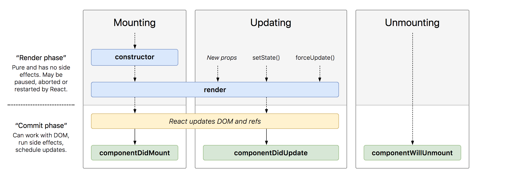

# useEffect & The React Lifecycle

## Learning Goals

By the end of this lesson you should be able to:

- Describe the lifecycle stages of a React component
- Use the `useEffect` hook to load content after a component has mounted
- Use the `useEffect` hook to run a callback function after state has changed

## Stages in React Lifecycle

Traditionally the lifecycle of a React component can be described by this drawing.



<!-- Source: http://projects.wojtekmaj.pl/react-lifecycle-methods-diagram/ -->

The lifecycle of a component has three stages.

1.  **Mounting** - When the component gets added to the DOM the first time.
1.  **Updating** - When props or state changes and the component must be re-rendered.
1.  **Unmounting** - When the component is removed from the DOM.

### Mounting

When a component is first added to the DOM, it is constructed, an instance of the component is created, and it's function is called.  Then React uses the rendered JSX to update the HTML.  At that point, we enter the `componentDidMount` stage. (Check back at the diagram above to see where this stage fits in.) If we need to load data from an external source like an API, we will choose to do that during the `componentDidMount` stage.

**Question**:  Why not load data from the API directly in our component's main function?  

<details style="max-width: 700px; margin: auto;">
  <summary>Our answer</summary>

  We could, but then the API or other request would run **every** time our function was called (ie. every time the component get re-rendered).  Further the API call might delay the rendering of our component leading to the app "hanging," and not responding to the user.  

  It is much more advantageous to make any API calls asynchronously after the app is fully rendered on the screen.  The user gets immediate feedback that the page is loaded and data can appear as it is retrieved.
</details>

We can provide React a function to run when it is in the `componentDidMount` stage by using the `useEffect` hook as follows.

```javascript
useEffect( /* Function to run when the component is mounted */  () => {  
    // Code to run upon mount
  },
  [] /* 
        The empty array indicates the above function sould be run once when the component is    mounted.
        It will not be run during future renders of the same component.
      */
);
```

### Updating

Alternatively, we can use the useEffect hook to watch for props or state variables and when they change we can use the `useEffect` hook to run a function when those variables change.  

So if we wanted to run a function when our `students` state variable changes we could do the following: 

```javascript
useEffect( /* Function to run when the `students` change */  () => {  
    // Code to run when it changes
  },
  [students] /* List of variables to watch and run the callback when they change. */
);
```

Note: This function will execute in the `componentDidUpdate` stage.

### Unmounting

When a component is unmounted or removed from the DOM, sometimes you want to do operations like:

1.  Save information to an external resource prior to exit
1.  Cancel any pending API requests that haven't returned yet

To provide a cleanup method for unmounting your `useEffect` callback function should return a function to call when the component is unmounted. This 

```javascript
useEffect( /* Function to run when the component is mounted */  () => {  
    // Code to run upon mount

    return /* Function to run on unmount */ function cleanup() {
      // Cleanup code here

    };
  },
  [] /* Empty Array indicates to run this once when the component is mounted. */
);
```

Note: This function will execute in the `componentWillUnmount` stage.

The need for cleanup like this is relatively rare in the applications we are learning to write but we wanted to make you aware of it.

Note: The function returned could also be an anonymous arrow function but we named it cleanup to be more explicit about it's purpose.

## useEffect with LocalStorage

Currently every time our application restarts any students we add disappear.  This is because we are not storing the list of students in any database or other long-term storage.  We can use a feature of the browser called [localStorage](https://developer.mozilla.org/en-US/docs/Web/API/Window/localStorage).  LocalStorage allows us to save key-value pairs in the browser to access when the JavaScript application restarts.

### Loading Data from Local Storage

We want to check localStorage for a list of students when our application starts up.  So we can use the `useEffect` hook.

First we will import the `useEffect` hook.

```javascript
import React, { useState, useEffect } from 'react';
```

Instead of pulling the information from a static array we can use localStorage.  After `App` is initially rendered, the code below will access local storage and try to find a key `studentList`. If that key is found it converts the value into an array with `JSON.parse` and updates the state.  If the key does not exist, it uses the initial array.

```javascript
// src/App.js
// ...

const App = () => {
  console.log('rendering');
  const [studentList, setStudentList] = useState([]);

  useEffect(() => {
    // get the studentList from localstorage
    const jsonStudentList = localStorage.getItem('studentList');
    // Convert the json into an Array, if it's null use the students array.
    const startingStudents = JSON.parse(jsonStudentList) || students;

    // Use the local storage to update state
    setStudentList(startingStudents);
  }, []);

  // ...
```

Notice above that the 2nd parameter to `useEffect` is an empty array `[]`.  This indicates that the callback function will be run **once** after the component is first mounted and rendered.  We will need to do something more if we want the localStorage to stay up to date with the studentList!

### Saving Data to localStorage

We can also set up a similar hook to execute every time the `studentList` is updated and save the results to local storage.  Notice below that the 2nd parameter to `useEffect` is an array with `studentList` inside it.   That tells React to call the function whenever `studentList` changes.  This field has to be a prop or state variable, something which could cause the component to re-render.

```javascript
  useEffect(() => {
    localStorage.setItem('studentList', JSON.stringify(studentList));
  }, [studentList]);
```

So the function above runs on the `update` stage whenever the `studentList` state variable changes.  We could even add the functionality to remove students from the list and this hook would automatically remove the students from localStorage as well.

**Question** On your local `ada-students` repository, checkout the `useEffect` branch if you haven't already. Open the app in two different browser windows.  If you update the list in one browser window, does the list get updated in the other window?  Why or why not?

<details>
  <summary>Answer</summary>

  By saving data into local storage we are saving the information into the **current browser's** local storage.  The information saved is specific to that browser.  If we want to save data for other browsers and people to access, we will need to use an API.
</details>

### !challenge

* type: multiple-choice
* id: 6a7b8f0b-9e26-4b38-aa58-6a25eb6d24b5
* title: Usage of the return
* points: 1 
* topics: react, hooks

##### !question

If the function passed to `useEffect` returns a function, when will the returned function get executed?

In other words, if the the code segment below were written within a component, when would "B" print to the console?

```javascript
useEffect(() -> {
  console.log("A");

  return () -> console.log("B");
}, []);

##### !end-question

##### !options

* After the component has Mounted
* After the component has Updated
* Before the component Unmounts
* All the the above

##### !end-options

##### !answer

* Before the component Unmounts

##### !end-answer

### !end-challenge

### !challenge

* type: multiple-choice
* id: 43699c07-22c1-4d15-a61a-1ccc0e03f9d1
* title: [text, a short question title]
<!-- * points: [1] (optional, the number of points for scoring as a checkpoint) -->
<!-- * topics: [python, pandas] (optional the topics for analyzing points) -->

##### !question

When an empty array is passed in as a second parameter to useEffect, when will the function get executed?

In other words, if the the code segment below were written within a component, when would "A" print to the console?

useEffect(() -> {
  console.log("A");

  return () -> console.log("B");
}, []);

##### !end-question

##### !options

* After the component has Mounted
* After the component has Updated
* Before the component Unmounts
* All the the above

##### !end-options

##### !answer

* After the component has Mounted

##### !end-answer

### !end-challenge

## Summary

There are 3 stages to the lifecycle of a component:
  1. Mount
  1. Update
  1. Unmount

In each stage, there is a "Commit Phase" after the "Render Phase", which allows us to perform any actions we want our application to execute asynchronously, without delaying the initial rendering of the webpage.

The `useEffect` hook allows us to specify a function to run during this "Commit Phase".

Depending on the way we write the callback function that is passed to useEffect, we can specify the function should be called after every render, only after the initial render (during `componentDidMount`), only after a specific value is updated ( during `componentDidUpdate`), or right before Unmount has completed (during `componentWillUnmount`).

## Resources

- [Using the Effect Hook](https://reactjs.org/docs/hooks-effect.html)
- [JavaScript in Plain English _React Hooks: How to use useEffect()_](https://medium.com/javascript-in-plain-english/react-hooks-how-to-use-useeffect-ecea3e90d84f)